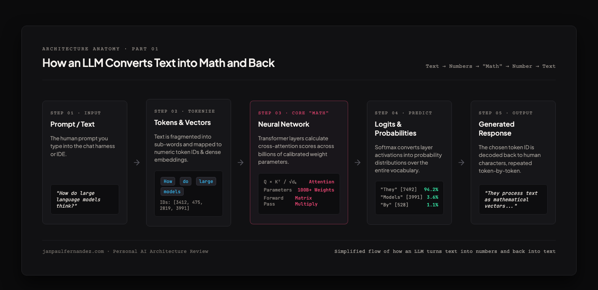
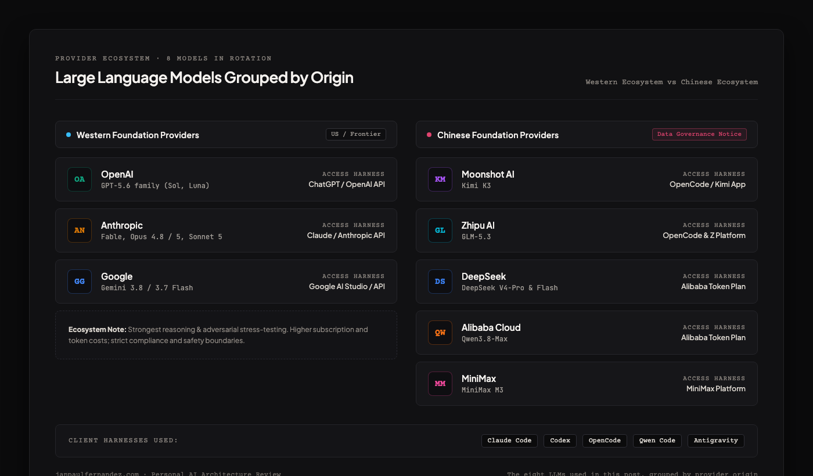
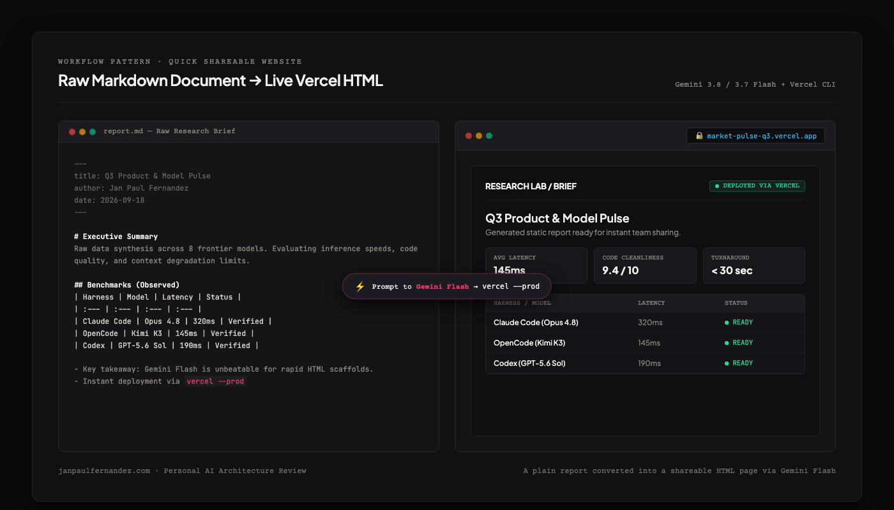
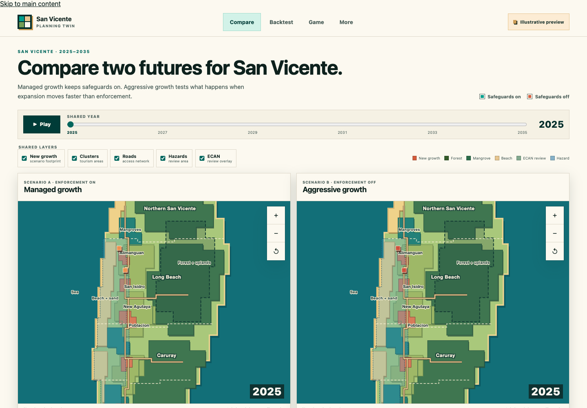
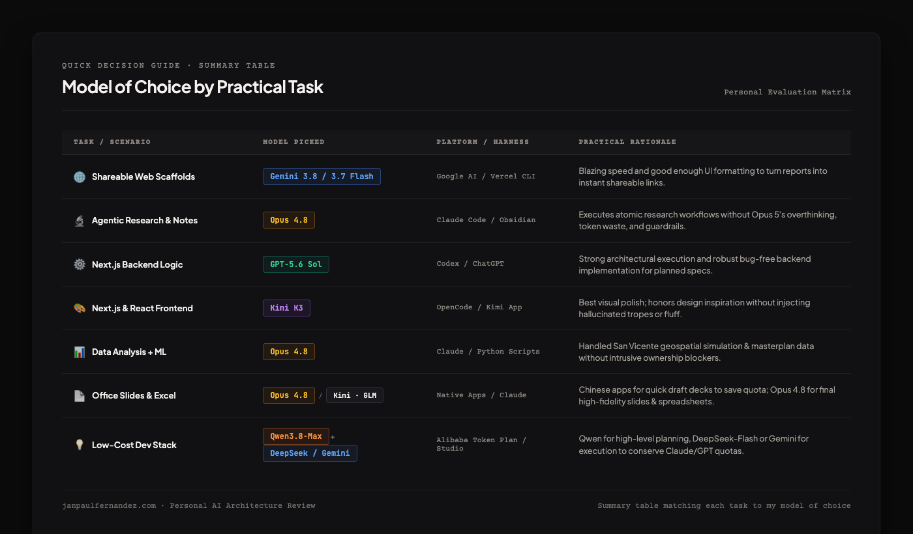

I know everyone gets lost nowadays where there's so many large language models to choose from, and with all the benchmaxxing (where companies tend to "cheat" on the model score) it's easy for someone to be overwhelmed on what model to choose.

I thought of writing this quick piece, not just to share what I know and what I experienced using these models, but also to document my own understanding of them.

<Callout variant="note">
**Disclaimer:** All of this is non-scientific, and based on my personal experience with the models and the providers. The models mentioned here are as of writing.
</Callout>

First let's talk about what an LLM is. To simplify it, it's the "brain" you interact with. When you chat with your AI, it converts your questions into numbers, does all the mathematical shit, outputs a number, and converts it into a word you can understand.

Without really explaining how to train an LLM — but basically, all of these companies have different ways and training sets to create their own LLM. It might be an oversimplification, but more data means the LLM is more knowledgeable, though the quality still depends on how it was trained.

Now going back, here's a quick run-through of the models I used and where I got them:

- **GPT-5.6 family** — via ChatGPT / OpenAI
- **Fable / Opus / Sonnet 5** — via Claude / Anthropic
- **Kimi K3** — via OpenCode
- **GLM-5.3** — via OpenCode and Z platform
- **DeepSeek V4-Pro and Flash** — via Alibaba token plan
- **Qwen3.8-Max** — via Alibaba token plan
- **Gemini 3.8** — via Google
- **MiniMax M3** — via MiniMax platform

For the harness, which is basically the "app" where I access the models, I use Claude Code, Codex, OpenCode, Qwen Code, and Antigravity.

For my work, I mainly do the following. Some work I do isn't listed here because it's too basic and most of the LLMs are capable enough to do them — like contextual search, managing my Docker instances, etc.

- **Knowledge work** — where I do research on a topic
- **Coding** — developing web and mobile apps
- **Data analysis and ML** — probably a subset of coding, but I've worked with large data

Okay, now that that's out of the way, here's some scenarios you've probably encountered already, and what model I used for them.

## Turning a document or information into a quick shareable website

I find it much easier to share a quick report in an HTML format nowadays. And with the Vercel or Netlify CLI, I can easily upload them online and share a link. Now this is separate from knowledge work. I usually do the knowledge work separately, and just ask models to convert it into a website.

**Verdict:** Any model is capable, so use what you already have. For me, Gemini 3.8 / 3.7 Flash is what I used for a good enough UI and fast generation.

## Knowledge work with agentic research

I maintain an Obsidian vault where I put in all my ideas, questions in life and product ideation. I maintain a clear workflow — domain scoring, scraping and templated atomic ideas. This agentic research follows that, and automatically runs all the Python scripts, etc.

**Verdict:** Opus 4.8. Why 4.8 and not 5? I found Opus 5 overthinks a lot, wasting a lot of tokens in the process. It also covers several edge cases that aren't yet necessary. I also found that it has a lot of unnecessary guardrails that limit me on executing the workflow.

## Coding with Next.js (backend and frontend)

I wanted to be particular on the programming language and framework here, as some models specialize in certain code. But since I usually work with React and React Native, I wanted to find a model that's good enough to execute my plans.

**Verdict:** GPT-5.6 Sol for backend, Kimi K3 for frontend. So far, I don't like how GPT-5.6 Sol handles my frontend design — I already have a DESIGN.md in place, and access to Mobbin MCP, but I find it worse than what Kimi K3 or even Opus 5 can provide even without design inspiration.

## Data analysis + ML

During my time in AIM MIB, we had an AI class where we had to create an ML project. The app we built is a simulation of San Vicente development, so we had to process a lot of geospatial data plus the masterplan.

**Verdict:** Opus 4.8. Again, I find Opus 5 overthinks a lot, and puts in unnecessary guardrails. It even asked me to provide a document proving that the data we have is ours. Mind you, the data is publicly accessible, and we got it from TIEZA.

## Document / Office Work

Okay, with the rise of AI, I don't really need to create PowerPoint presentations on my own, or any other documents. Given that this information is already processed, it just needs converting into documents.

If you don't want to waste the current usage of your subscription, I usually go with Kimi, MiniMax and GLM via their own apps. They create it good enough — good for internal presentation, or if you want a quick way to show your thoughts.

Opus 4.8 is also the best one for me in creating presentation slides and Excel sheets, balancing with the cost.

## Low-cost development stack

If you want to develop an app with low cost, here's what my stack usually is, to also save Claude or GPT usage.

Qwen3.8-Max for planning, and Deepseek-Flash or Gemini 3.8 for execution.

| Task / Scenario | Model Picked | Access Platform | Practical Rationale |
| :--- | :--- | :--- | :--- |
| **Shareable Web Scaffolds** | **Gemini 3.8 / 3.7 Flash** | Google AI / Vercel CLI | Fast generation and clean UI scaffold for instant links. |
| **Agentic Research & Notes** | **Opus 4.8** | Claude Code / Obsidian | Executes atomic ideas without Opus 5's overthinking and token waste. |
| **Next.js Backend Logic** | **GPT-5.6 Sol** | Codex / ChatGPT | Strong execution of specs with minimal runtime bugs. |
| **Next.js Frontend UI** | **Kimi K3** | OpenCode / Kimi App | Best visual polish; follows design without injecting unwanted tropes. |
| **Data Analysis & ML** | **Opus 4.8** | Claude / Python Scripts | Handled geospatial simulation & masterplan data without data blockers. |
| **Office Slides & Excel** | **Opus 4.8** / **Kimi · GLM** | Native Apps / Claude | Chinese apps for fast drafts; Opus 4.8 for final decks & sheets. |
| **Low-Cost Dev Stack** | **Qwen3.8-Max** + **DeepSeek / Gemini** | Alibaba Token Plan | Qwen for planning, DeepSeek/Gemini for high-throughput execution. |

So far, here's my not-so-detailed evaluation. I'll probably update it once we have another cycle of development. But so far, what I've realized is that this is not the time yet to be loyal to one brand — and also, sometimes cheap doesn't mean cheap if you had to repeat the work.

<Callout variant="warning">
**Notice:** Kimi, MiniMax, Qwen, DeepSeek and GLM are Chinese models. Unless you source them from an independent provider, your data will be processed and used as training data.
</Callout>
