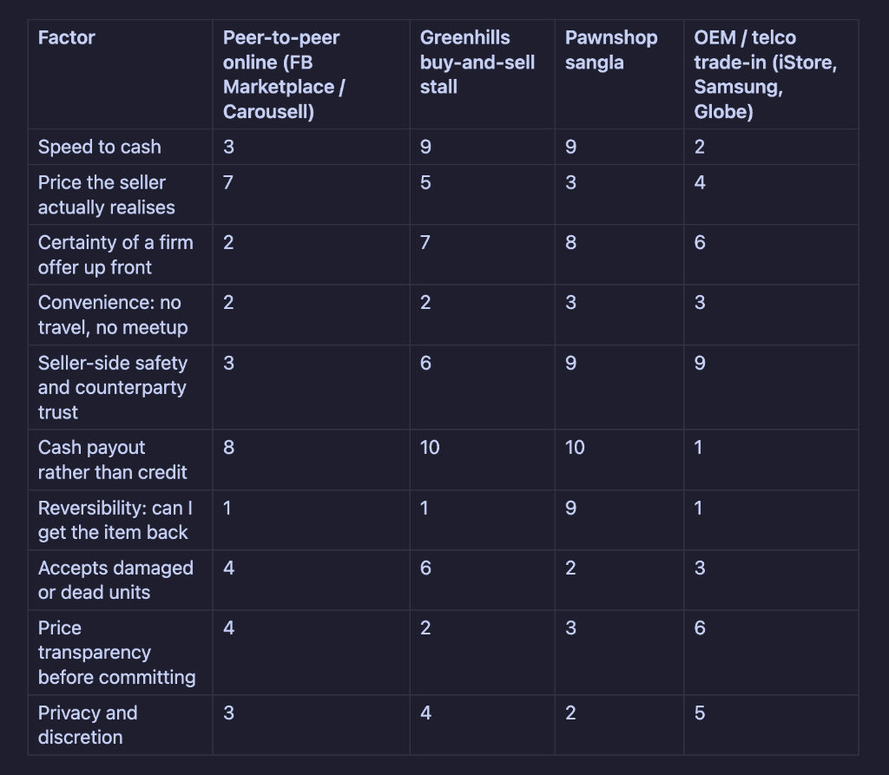
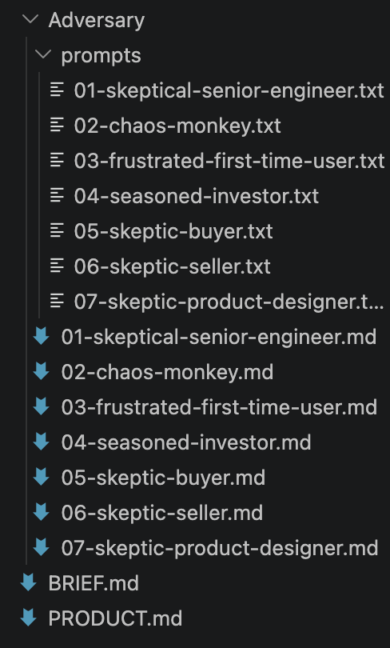

It might be a bit early to publish what I'm building, but I want to document my progress as I build our app and work toward releasing it to the public. I'm leveraging a lot of AI tools for both web and mobile development, and I think it will be fascinating to look back later and see how my stack evolves over time.

## Research & Validation

To start, I used my usual researcher agent—a custom setup combining Python scripts, web crawlers, and a CRAAP (Currency, Relevance, Authority, Accuracy, Purpose) test scorer, all orchestrated by an AI synthesizer. I'll write more about this specific pipeline in a future post, but I rely on it to validate ideas, identify Jobs-To-Be-Done (JTBD) value curves, and uncover potential opportunities and blind spots.

## Knowledge Work & Product Briefs

My "vibe coding" stack has evolved significantly since last year. *(As a software engineer, I still kind of cringe at the term—maybe "pseudo-coder" is more accurate, since I write pseudocode and pass it to AI. Or maybe I'm just in denial.)* With newer models and better harnesses released recently, some parts of the workflow simplified while others carried over. For the most part, I've stuck with what works because I haven't had time to conduct another deep-dive into workflow research.

For today's milestone, I focused on writing the project brief and product summary. I used Opus 5 for the heavy lifting. I was tempted to use Fable 5, but that felt like overkill for this stage. My knowledge work routine is straightforward: draft my initial thesis, run the research workflow, feed the results to the AI to brainstorm ideas and refine concepts, and explicitly flag key assumptions.

This process generated two core documents:
- **`BRIEF.md`**: Covers the project brief, core problems we're solving, the product concept, target audience, and key goals.
- **`PRODUCT.md`**: Defines the product vision, high-level feature specs, user personas, and user interaction flows.

## Red-Teaming with Adversary Personas

Next, I brought in GPT 5.6 Sol (high) to act as an adversary for red-teaming. Think of it as the hyper-critical teammate whose sole purpose is to pick apart everything you build. I set up several distinct personas:
- **Skeptical Senior Engineer**: Evaluates technical implementation and feasibility.
- **Chaos Monkey**: Stress-tests the core concept in every scenario imaginable.
- **Seasoned Investor**: Scrutinizes business viability and market assumptions.
- **Skeptical Buyer & Seller / Frustrated User**: Challenges user experience, value exchange, and adoption friction.

To run through all these personas efficiently, I used DeepSeek V4 Flash (via Alibaba's Token Plan) executing `codex` commands to iterate through the prompts and aggregate feedback.

## Day 1 Deliverables

By the end of Day 1, I walked away with:
- **Research Dossier + JTBD Value Curve**: Competitor positioning and value trade-off matrix.
- **`BRIEF.md` & `PRODUCT.md`**: Foundational project brief and product requirements.
- **Adversary Personas Suite**: Red-teaming prompts and detailed critique reports (`01-skeptical-senior-engineer.md` through `07-skeptical-product-designer.md`).

## What's Next?

My next step will likely be having Opus 5 review and address the critiques generated by GPT 5.6 Sol—synthesizing the adversary feedback into actionable refinements for our project brief and product specs.
