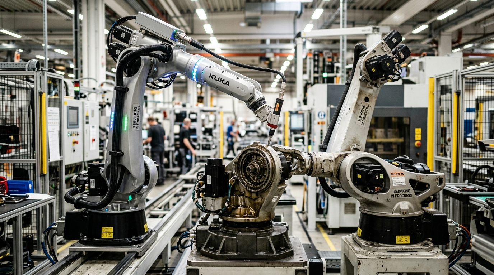
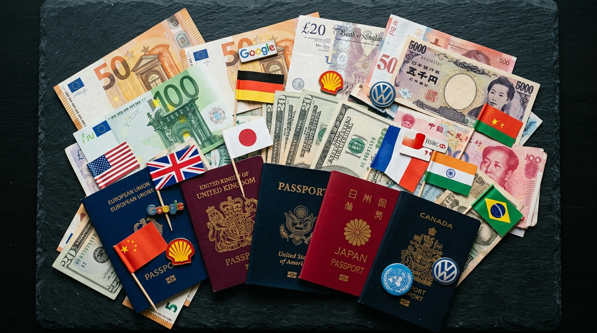
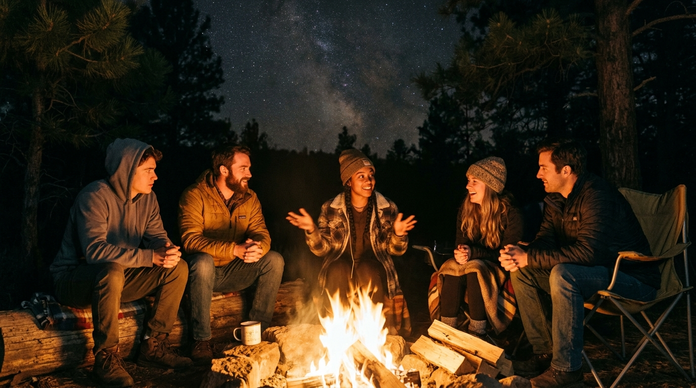
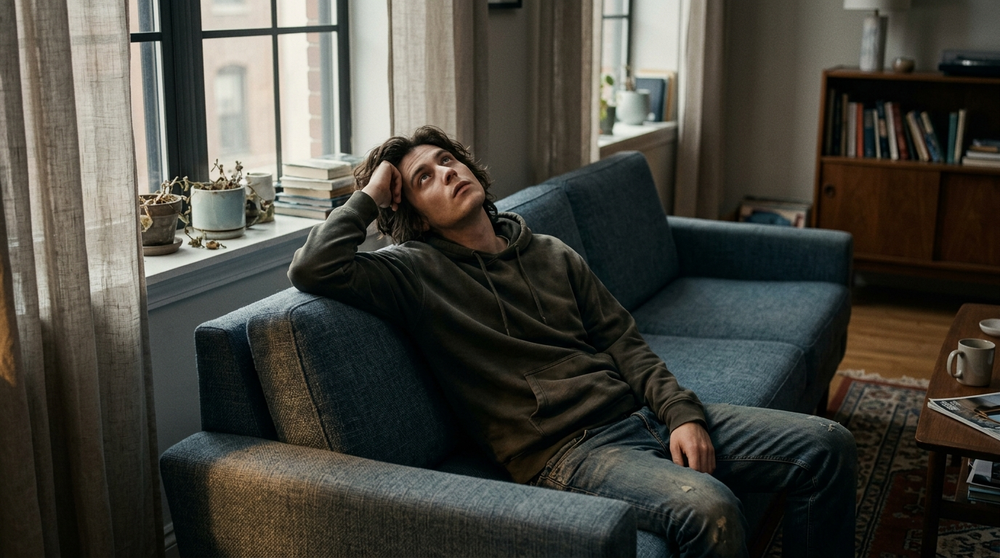
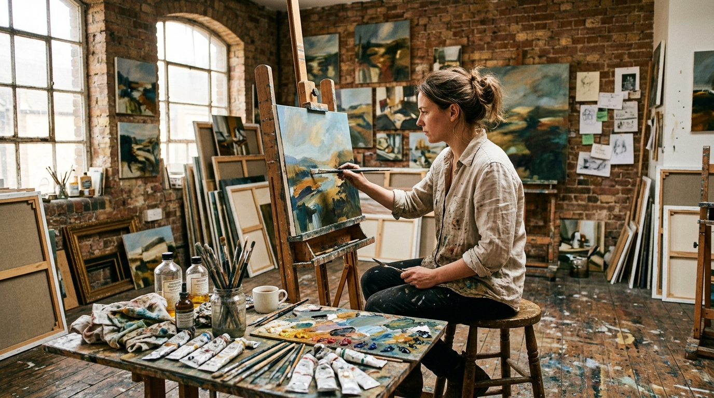
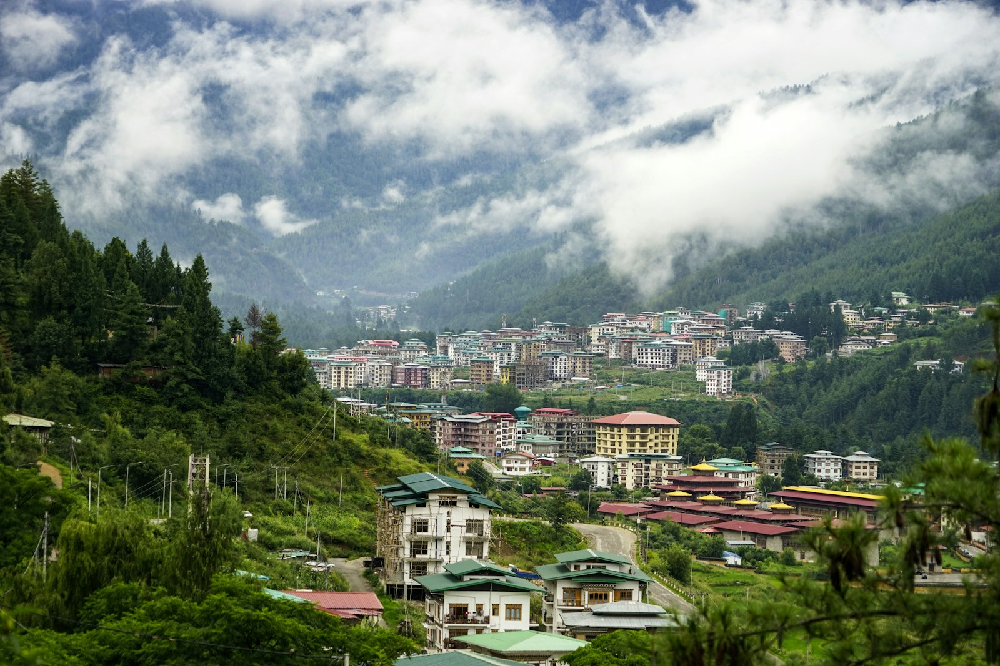
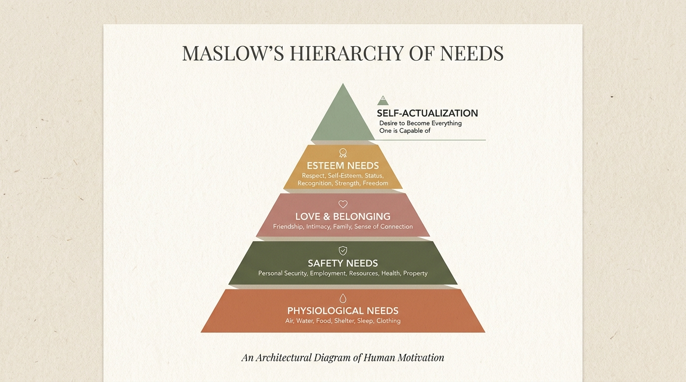
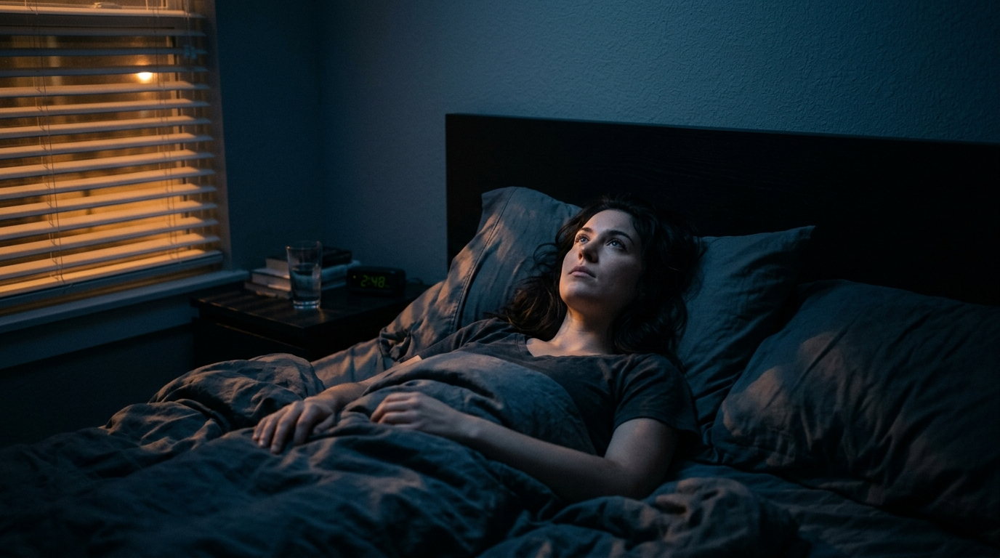

One rainy night after our AI class, my good friend Otep offered me a ride home. Otep is a cohortmate I enjoy talking to about anything nerdy, from running his brick-and-mortar business to the ethics and morality of AI.

The question I kept turning over with him that night: if AI takes all the jobs, what do we do with all that free time?

But what does "taking all the jobs" even mean? Wouldn't we just make new ones? Then again, imagine we have all this AI and we give it a physical body through robotics. It could take over the manual and dangerous work too. Would we still need real humans watching it, maintaining the network and such? And what stops us from automating that as well, with another batch of robots and AI?

It goes on and on. Some jobs get eliminated completely, because an AI serving another AI doesn't really make sense.

What about keeping a human in the loop? To me, that's really just assigning a fall guy who will take the blame. If we have an AI with unlimited tokens, what stops us from spawning a council of AI, objective enough to argue a decision out among themselves?

So what now? Do we all get a basic salary? Or is capitalism just communism with extra steps?

What do we actually do?

## We talk

Yuval Noah Harari's argument in *Sapiens* is that what makes us human is our ability to believe in fiction. Not fiction in the sense of a warning about danger beyond the mountains — plenty of animals can signal danger to each other. Bees dance directions to a flower patch. Vervet monkeys have different alarm calls for eagles and snakes.

The fictions Harari means are the ones with nothing behind them at all. Money. Nations. Gods. Corporations. Human rights. None of these exist in any physical sense, and yet millions of strangers will cooperate, pay taxes, and die for them. A chimpanzee cannot be convinced to hand over a banana today for a promise of paradise after death.

Harari also has a gossip theory of language: that we developed talk not mainly to describe the location of a lion, but to keep track of each other. Who is reliable. Who is sleeping with whom. Who is quietly becoming a problem. Unlike other animals who fight to claim the title of alpha, humans do politics.

Now here's the part I find striking. Polly Wiessner spent decades recording conversations among the Ju/'hoansi in the Kalahari, and in a 2014 paper she compared what people talked about during the day versus what they talked about at night around the fire. Daytime talk was practical: economics, land, complaints, gossip used to keep people in line. Night talk was different. Stories. Distant relatives. Adventures, hunts, spirits, things that had happened to people three villages over.

The daytime hours were productive. The firelit hours were not. And that unproductive time is exactly where the storytelling went.

<PullQuote>
So maybe it isn't that we tell stories despite having time. Maybe we tell stories because we have it.
</PullQuote>

## Are we just bored animals?

This is where I want to push a little further. Why do we even want entertainment?

The psychology of boredom has a decent answer. Researchers like Wijnand van Tilburg and Eric Igou describe boredom as a meaning-regulation signal: it's the unpleasant feeling that shows up when what you're doing has stopped feeling significant, and it pushes you to go find something that does. James Danckert frames it as a nudge to stop exploiting and start exploring. Andreas Elpidorou argues something similar — boredom is functional, not a defect. It exists to get you off the couch.

I like this because it means boredom is not a modern software bug from having too much free time. It's closer to hunger. It is an alarm that goes off when your attention has nothing worth doing, and it is deeply annoying on purpose.

So yes, I think we might be naturally bored animals. And storytelling may be the oldest thing we invented to answer that alarm.

## But then, art

So is our true value in life to make art?

I personally believe art comes from personal struggle, and from how we see the world. If we live in a world with no jobs, what would our struggles even be? Where would the inspiration come from?

Though I'll admit the counterargument writes itself: people who want for nothing are famously good at finding things to suffer about.

And there's a second problem. In economics there's diminishing marginal utility — eat the same sweets over and over and each one gives you less satisfaction than the last. Psychologists have a version of this for life in general, the hedonic treadmill: we adapt to good things and drift back to roughly the baseline we started from. Does entertainment work the same way?

Does that mean our yapping ends too?

## Whose happiness are we optimizing for?

Another thing: the happiness we know now is largely shaped by how capitalism decided happiness should look.

In our economics class we studied Bhutan's Gross National Happiness. In 1972 the fourth king, Jigme Singye Wangchuck, said gross national happiness mattered more than gross domestic product, and Bhutan has been trying to build actual instruments around that ever since. The critique underneath it is fair: GDP was never designed to measure welfare. Simon Kuznets, who helped build it, said so himself.

There are holes in GNH too. But what I keep noticing is that happiness is relative. Richer countries do score higher on average — I don't want to romanticize poverty. But the gap is far smaller than the income gap would predict, and a country getting much richer over time barely moves its happiness numbers. That's the Easterlin paradox, and the usual explanation is that what we're really tracking is our position relative to the people around us, and our own rising expectations. People with less can be moved by a gentle nudge to their current situation. People with more need a much bigger nudge for the same feeling.

Then there's Maslow. If we're disconnected from what we do all day, where do esteem and self-actualization come from? Maslow put those at the top for a reason.

Maybe capitalism has been ingrained in us so deeply that our identity is now welded to our work, and we can't picture it being anything else. It's the first question we ask strangers. What do you do?

So if AI takes our jobs, we're supposed to entertain ourselves.

<KeyTakeaway>
Or maybe, when AI takes all the jobs, we finally get the time to look for what our lives actually mean — and to find out whether the human hunger for efficiency and comfort is truly insatiable.
</KeyTakeaway>

These thoughts still keep me awake at night, long after that ride home with Otep. Maybe I'm just overthinking it and none of this will ever really happen. But then again, I wanted to look at it philosophically, as a way of asking why we live at all.

I guess for now, we will never know.

---

### Sources referenced

- Yuval Noah Harari, *Sapiens: A Brief History of Humankind* (2011) — shared fictions, gossip theory of language
- Polly Wiessner, "Embers of society: Firelight talk among the Ju/'hoansi Bushmen," *PNAS* 111(39), 2014
- Wijnand van Tilburg & Eric Igou on boredom as meaning-regulation; James Danckert on exploration vs exploitation; Andreas Elpidorou, *Boredom and Cognitive Engagement: A Functional Theory of Boredom* (2021)
- Bhutan's Gross National Happiness, introduced 1972 under King Jigme Singye Wangchuck; IMF Working Paper 2019/015 on GNH and macroeconomic indicators
- Richard Easterlin (1974) on income and happiness; hedonic adaptation literature
