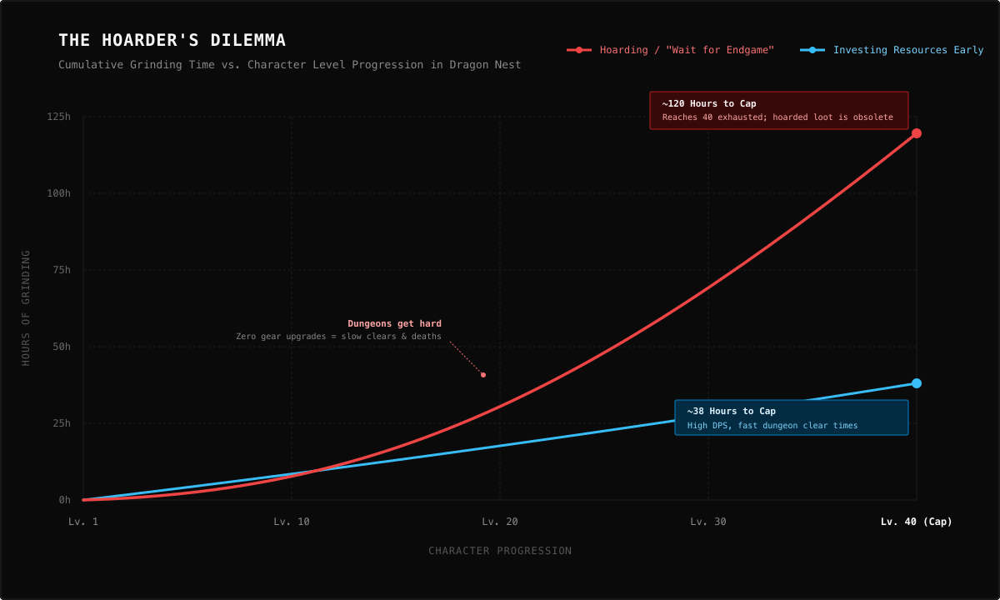

I don't know why I suddenly remembered that episode of *Rick and Morty*: *Edge of Tomorty: Rick Die Rickpeat*. 

In this episode, Morty gets an enigmatic "death crystal"—if you look at it, you see the consequences of your actions in real time and you can choose which path to take. Morty just wants to end up with Jessica, so he tries to choose whatever route leads to having a relationship with her.

It might be an understatement to say that I live with this reality. 

Growing up, I was always a perfectionist (and lazy). I get paralyzed by so many decision points because I want to choose the best one. It's funny because I only really realized this playing RPG games. 

## The Acrobat

I invested so many hours into *Dragon Nest*. My character was an Acrobat. If you played it during the early days, materials and equipment for acrobats were scarce and expensive. So I grinded all the way to level 40 without spending much gold or materials on improving my character's gear. I'm just realizing it now: by trying to be so perfect, I was holding back my own virtual character.

And this wasn't just in one game—it manifested in a lot of games I played. Just because I was always trying to get the best out there.

## Living in Multiple Futures

Now why am I talking about Morty? 

Maybe because I feel like I am Morty without the crystal. I am afraid to take an action, because I'm not sure if it's the best one for me. I live in multiple futures, but I end up not living in the present.

<PullQuote>
I am afraid to take an action, because I'm not sure if it's the best one for me. I live in multiple futures, but I end up not living in the present.
</PullQuote>

And yes, this is another thought dump about AI, because that thing gave me the "death crystals." 

I catch myself asking help from AI to weigh in on some of my decisions. I don't think this is an AI problem—it's more of a me problem. Even without AI, I think this way. But AI helps me scratch that itch, and somewhat gives me a grounding feeling.

## Thinking Rocks

To be candid about it, I am diagnosed with executive dysfunction, depression, and anxiety. The whole package. 

And I guess one positive impact of these thinking rocks for me is that I am able to ground myself without dumping these negative thoughts onto others. I know human interaction is still the best approach, and I still do that once my brain is in the right state. It's just so hard to ask for help if you're also anxious about how they will perceive you.

Maybe I guess I need a death crystal after all.
